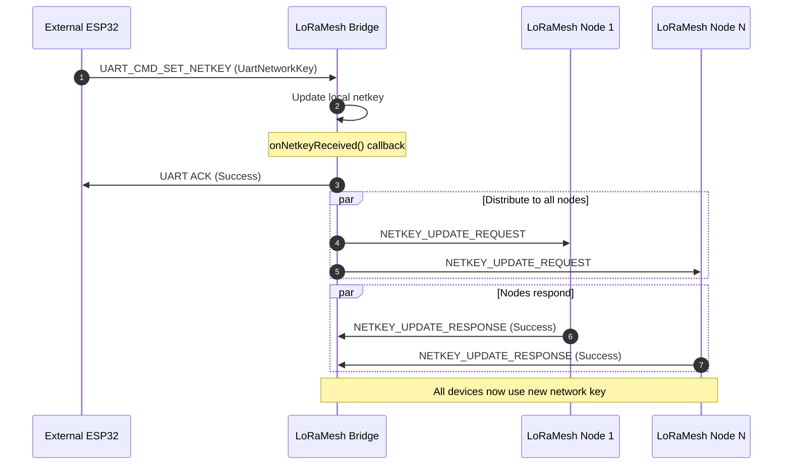

# Dynamic Network Key Distribution Implementation

## Tổng quan giải pháp

Bạn đã yêu cầu đơn giản hóa hệ thống bảo mật với 2 yêu cầu chính:
1. **Toàn mạng sử dụng 1 netkey** (thay vì mỗi device key riêng)
2. **Bridge nhận netkey từ ESP32 external qua UART** và phân phối cho toàn bộ nodes

## Kiến trúc Implementation

### 1. UART Protocol Extension
- **File modified**: `uart_protocol.h`, `uart_protocol.cpp`
- **New command**: `UART_CMD_SET_NETKEY = 0x14`
- **New structure**: `UartNetworkKey` chứa networkKey[16], authToken[8], networkId, keyVersion, timestamp
- **Callback mechanism**: Bridge register callback để xử lý netkey nhận từ UART

### 2. NetkeyDistributionService
- **New files**: `NetkeyDistributionService.h/.cpp`
- **Chức năng**: Quản lý việc phân phối network key từ Bridge ra toàn bộ nodes
- **Packet types**: 
  - `NETKEY_UPDATE_REQUEST` (0x90): Bridge → Node
  - `NETKEY_UPDATE_RESPONSE` (0x91): Node → Bridge  
  - `NETKEY_UPDATE_BROADCAST` (0x92): Reserved cho broadcast

### 3. Bridge Application Integration
- **File modified**: `bridge_app.h/.cpp`
- **Callback**: `onNetkeyReceived()` - nhận netkey từ UART và trigger distribution
- **Callback**: `onNetkeyUpdated()` - confirm local key update thành công

### 4. Node Application Integration  
- **File modified**: `node_app.h/.cpp`
- **Callback**: `onNetkeyUpdated()` - nhận và apply new netkey từ Bridge

### 5. LoraMesher Core Integration
- **File modified**: `LoraMesher.h/.cpp`
- **New method**: `sendPacket(const uint8_t* packetData, size_t packetSize)` - để send raw packets
- **Packet processing**: Thêm netkey packet handling trong `processPackets()`

## Message Flow

### Luồng cập nhật Network Key:



## Cấu trúc Packet

### UartNetworkKey (UART)
```cpp
struct UartNetworkKey {
    uint8_t networkKey[16];    // 128-bit network key
    uint8_t authToken[8];      // Authentication token
    uint16_t networkId;        // Network identifier  
    uint8_t keyVersion;        // Key version for tracking
    uint32_t timestamp;        // Key generation timestamp
};
```

### NetkeyUpdatePacket (Mesh)
```cpp
struct NetkeyUpdatePacket {
    PacketHeader header;       // Standard mesh header
    uint8_t netkeyType;       // NETKEY_UPDATE_REQUEST
    uint8_t keyVersion;       // Key version
    uint16_t networkId;       // Network ID
    uint8_t networkKey[16];   // New network key
    uint8_t authToken[8];     // Auth token  
    uint32_t timestamp;       // Timestamp
    uint8_t mac[4];          // MAC for integrity
};
```

## Security Considerations

### MAC Protection
- Mỗi netkey packet được protect bằng HMAC-SHA256 (truncated to 4 bytes)
- MAC được tính trên toàn bộ packet (exclude MAC field)
- Sử dụng current network key để generate/verify MAC

### Authentication
- Chỉ Bridge (address 0x01) được phép send netkey updates
- Nodes validate sender address trước khi accept key update
- Key version tracking để prevent replay attacks

### Key Transition
- Bridge update local key trước khi distribute
- Nodes confirm key update thành công qua NETKEY_UPDATE_RESPONSE
- Consistent MAC calculation đảm bảo all devices đồng bộ key

## Usage Instructions

### 1. External ESP32 gửi network key
```cpp
// Tạo netkey structure
UartNetworkKey newKey;
// Set networkKey, authToken, networkId, keyVersion, timestamp
memcpy(newKey.networkKey, newNetworkKey, 16);
memcpy(newKey.authToken, newAuthToken, 8); 
newKey.networkId = 0x1234;
newKey.keyVersion = 2;
newKey.timestamp = getCurrentTime();

// Send qua UART với command UART_CMD_SET_NETKEY
sendUartCommand(UART_CMD_SET_NETKEY, &newKey, sizeof(newKey));
```

### 2. Bridge tự động distribute
- Bridge nhận key qua UART callback
- Automatically update local security config  
- Send NETKEY_UPDATE_REQUEST tới tất cả nodes trong routing table
- Log success/failure của distribution process

### 3. Nodes tự động update
- Nodes nhận NETKEY_UPDATE_REQUEST packet
- Validate MAC và sender address
- Update local `MeshSecurityConfig` với new key
- Send NETKEY_UPDATE_RESPONSE confirm về Bridge

## Files Created/Modified

### New Files:
- `src/components/lora_mesh_manager/src/services/NetkeyDistributionService.h`
- `src/components/lora_mesh_manager/src/services/NetkeyDistributionService.cpp`

### Modified Files:
- `src/application/app_bridge/uart_protocol.h` - Added netkey command & structure
- `src/application/app_bridge/uart_protocol.cpp` - Added netkey handling
- `src/application/app_bridge/bridge_app.h` - Added netkey callbacks
- `src/application/app_bridge/bridge_app.cpp` - Added netkey integration
- `src/application/app_node/node_app.h` - Added netkey callback
- `src/application/app_node/node_app.cpp` - Added netkey handling
- `src/components/lora_mesh_manager/src/core/LoraMesher.h` - Added sendPacket method
- `src/components/lora_mesh_manager/src/core/LoraMesher.cpp` - Added netkey processing

## Testing

### Build Test:
```bash
cd /home/truongvv/Projects/LoraMesh/LM_LR_MESH
platformio run
```

### Runtime Test:
1. **Bridge logs**: Expect "Netkey Distribution Service initialized"
2. **Node logs**: Expect "Netkey Distribution Service initialized for node"  
3. **UART test**: Send netkey command từ external ESP32
4. **Mesh test**: Check nodes receive & apply netkey updates
5. **Security test**: Verify encrypted communications với new key

## Lợi ích của giải pháp

### 1. Đơn giản hóa key management
- Chỉ cần distribute 1 key cho toàn mạng
- Centralized key control từ external system
- Dynamic key updates không cần reflash firmware

### 2. Tăng tính bảo mật
- Key rotation support (keyVersion tracking)
- MAC protected key distribution
- Authenticated key updates từ trusted Bridge

### 3. Operational efficiency  
- UART interface dễ integrate với management systems
- Automatic distribution tới all mesh nodes
- Confirmation mechanism đảm bảo success

### 4. Backward compatibility
- Existing security framework vẫn hoạt động
- Không breaking changes cho existing applications
- Progressive rollout support

## Next Steps (Optional enhancements)

1. **Persistent storage**: Store netkey trong NVS để survive reboot
2. **Key rotation scheduling**: Automatic periodic key updates
3. **Revocation support**: Blacklist old keys, force key updates
4. **Monitoring**: Key distribution status reporting qua UART
5. **Fallback mechanisms**: Retry logic cho failed distributions

Giải pháp này đáp ứng đầy đủ yêu cầu của bạn với cách tiếp cận đơn giản, bảo mật và scalable.